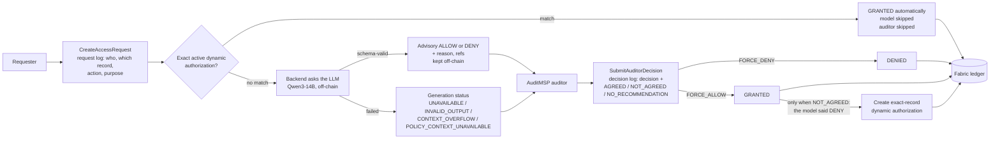

# DIAS architecture

DIAS is **Dynamic and Explainable Access Control for Blockchain-enabled
Inter-organizational Data Sharing**.

One sentence carries the whole design: **the model recommends, a human auditor
decides, and only an auditor's override of a model DENY can create a reusable
authorization.** Everything below exists to make that true by construction rather
than by convention.

## The workflow



Every arrow into the ledger is a committed transaction with its own lifecycle
event. `AuditContract.GetRequestAuditTrail` replays the whole path for one
request from committed state. The LLM recommendation, the justification and the
auditor's reason never reach the ledger; the backend keeps them in its off-chain
review store for the auditor screen and for reviewers.

## What the ledger records

For every request the ledger holds two logs:

1. **Request log** (`CreateAccessRequest`): who requested which record — the
   stable user id, organization and role — with the case, action, purpose, the
   verified facts, and the dynamic-authorization check.
2. **Decision log** (`SubmitAuditorDecision`): the auditor, `FORCE_ALLOW` or
   `FORCE_DENY`, and whether it agreed with the LLM recommendation shown to the
   auditor: `AGREED`, `NOT_AGREED`, or `NO_RECOMMENDATION`.

The backend derives the agreement value from the stored recommendation; the
browser never supplies it. The chaincode uses it for exactly one rule: a
`FORCE_ALLOW` that is `NOT_AGREED` means the model recommended DENY, so it
creates the exact-scope dynamic authorization.

## The model is advisory, and that is enforced

1. **Vocabulary.** The response contract admits exactly `ALLOW` and `DENY`.
   `ESCALATE` is not a label. Failure to generate is a *status*, never a
   recommendation.
2. **No runtime evaluator.** No live code path can reach a deterministic policy
   engine. The offline reference oracle exists — it labels the training data and
   validates the dataset — which is exactly why its absence from the runtime is
   enforced rather than assumed. `backend/test/architectureGuard.unit.test.js`
   walks the real `require` graph from the live entry points and fails if the
   oracle or any SEAL-era policy module is reachable;
   `chaincode/crimerecords/test/architectureGuard.test.js` does the same for the
   deployed chaincode and asserts the package excludes them.
3. **Authority in the contract.** The model writes nothing to the ledger. Only
   `SubmitAuditorDecision` and the dynamic-authorization check produce an access
   outcome.

If the model returns a schema-valid recommendation, it reaches the auditor
**unchanged**. Nothing corrects it.

## What the model is shown

The backend gives the model the **verified request** — the facts the chaincode
derived from the requester's certificate and committed ledger state, taken from
the committed request and checked against its committed hash — the complete
governance policy, and the requester's justification in a delimited untrusted
block.

```
requester  mspId, organization, role, rank, station, jurisdiction,
           clearance, credentialStatus, assignedToRequestedCase
resource   recordType, caseId, sensitivityLevel, jurisdiction, owningAgency,
           owningStation, sealed, juvenileFlag, witnessFlag, victimProtectionFlag
request    action, purpose, emergencyFlag, approvalTokenPresent
```

`action` and `purpose` are supplied as structured facts, not inferred from the
text. Usernames, record identifiers and enrollment IDs are **deliberately
absent**: they are audit facts, not policy facts, and a model that can see them
can learn them as shortcuts.

The justification is data. The policy says so (`GP-CONTEXT:C1@v1`), the prompt
says so, the delimiters are neutralised against forgery, and the training data
contains explicit injection and false-claim examples. None of that is the real
protection: **the real protection is that a successful injection produces a wrong
recommendation, which an auditor reads next to the justification that caused
it.** No injection can grant access, because the model cannot grant access.

## Dynamic authorizations

A dynamic authorization is the only way a later request bypasses both the model
and the auditor. It is created by **exactly one** combination:

| Model | Auditor | Outcome | Decision log | Authorization |
| --- | --- | --- | --- | --- |
| ALLOW | FORCE_ALLOW | granted | AGREED | none |
| ALLOW | FORCE_DENY | denied | NOT_AGREED | none |
| DENY | FORCE_DENY | denied | AGREED | none |
| **DENY** | **FORCE_ALLOW** | **granted** | **NOT_AGREED** | **created** |
| none (failure) | either | as the auditor decided | NO_RECOMMENDATION | none |

Scope is **exact**, `dias-authorization-scope-exact-record-v1`:

```
stableUserId · recordId · caseId · action · purpose
```

plus the committed hash of the governed conditions. A match requires all of
them, an active status, no revocation, no expiry, and unchanged facts. A rule
for one record can never authorize another record, however similar.

Matching reads the **latest committed world state inside the same transaction**
that commits the request — never a local cache.

`FORCE_DENY` never implicitly revokes. Revocation is its own transaction and
always carries a reason. That choice, and the risk it leaves, are recorded in
[policy-open-questions.md](policies/policy-open-questions.md) §10.

## Trust boundaries

| Participant | May do | May not do |
| --- | --- | --- |
| Requester | create a request; use its own granted outcome | decide its own request; reuse another identity's authorization |
| Backend (DIAS API) | call the LLM; keep the recommendation, justification and auditor reason off-chain; derive the LLM agreement | write an access decision without an auditor; invent a recommendation when generation fails |
| AuditMSP district head | decide any pending request; revoke an authorization; read the full trail | decide a request they raised; decide on facts that changed since the request |
| Owning agency | release raw content against a current granted basis | release against an expired, revoked or stale grant |

The ledger proves who requested which record, what the auditor decided, and the
agreement value the backend reported. It does **not** prove what the LLM said:
that record is held by the backend.

## Privacy

| Where | What |
| --- | --- |
| Shared ledger | request log (requester, record, case, action, purpose, verified facts), decision log (auditor, decision, LLM agreement), outcomes, dynamic authorizations and their lifecycle |
| Backend review store (`backend/data/dias-reviews/`) | the justification text, the LLM recommendation with its explanation and provenance, the auditor's reason |
| Owning-agency vault | raw case narratives and PDF bytes |

## Deployment shape

- **Channel** `diaschannel` with five organizations — police, forensics,
  prosecution, court, and the oversight organization. There is no AI
  organization; the SEAL-era `crimechannel` keeps running untouched.
- **Chaincode** `diasrecords` 2.2 on `diaschannel`. 2.1 added the public case-file
  lookup by identifier to `RecordContract.QueryRecords`; 2.2 added
  `AccessContract.QueryAccessDecisions`, the decision log every identity on the
  channel can read. The access workflow is unchanged from 2.0.
- **API and UI** — `backend/src/server.js` and the static frontend. The API calls
  the model, answers requests one at a time, and on restart resumes any
  recommendation a previous process left pending.
- **Model** — MLX-LM OpenAI-compatible server, off-chain, on port 8081.

## Where each rule lives

| Rule | Enforced in |
| --- | --- |
| binary vocabulary | `lib/dias/recommendationSchema.js` (shared with the backend and dataset tooling) |
| verified-request shape and hash | `lib/dias/verifiedRequest.js` |
| exact scope, matching, revocation, expiry | `lib/dias/authorization.js` |
| lifecycle events | `lib/dias/lifecycle.js` |
| request and decision logs, authority model | `lib/accessContract.js` |
| trail reconstruction | `lib/auditContract.js` |
| the single prompt | `backend/src/dias/recommendationPrompt.js` |
| the recommendation call | `backend/src/dias/recommender.js` |
| off-chain review store | `backend/src/dias/reviewStore.js` |
| recommendation worker | `backend/src/dias/recommendationWorker.js` |
| LLM agreement | `backend/src/dias/agreement.js` |

The prompt module is shared by live inference, dataset generation and
evaluation, so training and serving cannot drift.
