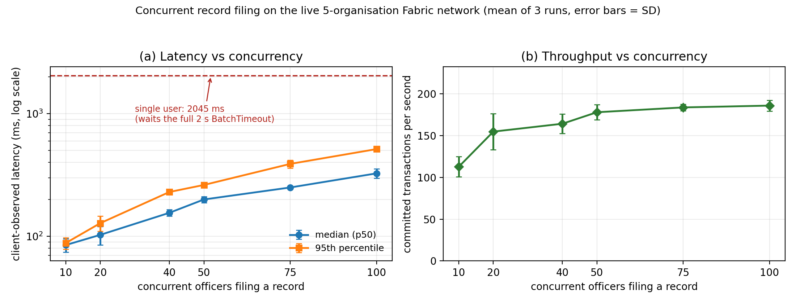

# Concurrent record filing on the live Fabric network

What happens to latency when many officers file a record at the same moment.

Measured on the real 5-organisation Hyperledger Fabric network, not a
simulation. Every request went through REST validation, the agency vault, the
Fabric Gateway, endorsement, ordering and commit.

---

## What was measured

`POST /records` → `RecordContract.CreateCaseRecord`. This is a **write**, so it
travels the full path and has to wait for a block. The number reported is
client-observed end-to-end time: what the officer's browser would actually feel.

For each level, all N requests are released **together** and awaited as one
batch. That is genuine concurrency, not a loop.

| Setting | Value |
|---|---|
| Levels tested | 1 (control), 10, 20, 40, 50, 75, 100 |
| Repetitions | 3 full sweeps |
| Total measured requests | 888 (plus 15 discarded warm-up) |
| Failures | **0** |
| Identity pool | 5 enrolled police identities, cycled across the N clients |
| Ledger keys | every request writes a unique `recordId`, so no two collide |

---

## Results

Mean of 3 runs, ± standard deviation.

| Concurrent officers | Median latency (ms) | 95th percentile (ms) | Throughput (tx/s) |
|---:|---:|---:|---:|
| 1 *(control)* | 2045.4 ± 3.5 | 2045.4 ± 3.5 | 0.5 ± 0.0 |
| 10 | 84.8 ± 10.6 | 88.1 ± 9.5 | 112.8 ± 12.2 |
| 20 | 102.7 ± 17.6 | 128.0 ± 18.2 | 154.9 ± 21.7 |
| 40 | 155.4 ± 9.6 | 229.7 ± 11.1 | 164.3 ± 11.6 |
| 50 | 199.6 ± 11.8 | 262.2 ± 11.1 | 178.1 ± 9.0 |
| 75 | 250.1 ± 3.3 | 389.5 ± 29.6 | 183.8 ± 3.9 |
| 100 | 325.9 ± 28.1 | 514.3 ± 21.0 | 186.0 ± 6.5 |



---

## What the numbers mean

**The single-user figure is an artifact, not a limit.** The orderer is
configured with `BatchTimeout: 2s` and `MaxMessageCount: 10`. A block is cut
when either two seconds pass or ten transactions queue up. One user alone never
fills a block, so that request sits waiting for the timer — hence 2045 ms.

**Ten simultaneous users make it 24× faster.** At N=10 the block fills on count
instead of time, so the wait disappears and median latency drops to 84.8 ms.
This is the opposite of the usual expectation that more load means more delay.

**Beyond that, latency grows gently and predictably.** From 10 to 100 users the
median rises 84.8 → 325.9 ms, roughly 3.8× for 10× the load. The 95th
percentile rises faster (88 → 514 ms), which is the normal signature of queueing.

**Throughput saturates near 186 tx/s.** It climbs steeply to N=50 and then
flattens: 178 → 184 → 186. Past this point the network is absorbing about as
much as this host can commit, and extra concurrency turns into latency rather
than additional throughput.

**Nothing failed.** 888 of 888 requests committed successfully at every level,
including 100 at once. No MVCC read conflicts occurred, because concurrent
filings write distinct ledger keys and only read the shared case key.

---

## Environment

| Item | Value |
|---|---|
| Channel | `crimechannel` |
| Chaincode | `crimerecords` |
| Organisations | 5, one peer each |
| Ordering | single-node Raft |
| State database | CouchDB |
| `BatchTimeout` | 2 s |
| `MaxMessageCount` | 10 |
| Host | single machine, Colima 10 vCPU / 24 GiB |

---

## Honest limits

- **Single host.** All five organisations, the orderer and the load generator
  share one machine. This is not a distributed or geo-replicated benchmark, and
  the numbers should not be read as production capacity.
- **Latency includes the block wait.** It is end-to-end commit time, not policy
  computation time. The policy engine itself is a small fraction of this.
- **Concurrency is simulated from 5 identities**, not 100 distinct officers.
  This measures system throughput, not identity-registry scaling.
- **Synthetic records only.** No real case content was used.
- **One workload shape.** Every request files the same type of record against
  the same case. Mixed workloads were not measured.
- **The ledger now holds ~900 `LOAD-*` records** from these runs. They are
  clearly named and harmless, but `make down && make all` gives a clean ledger.

---

## Reproducing

```bash
make all
make backend
```

Then, from this folder:

```bash
RUN_LABEL=run1 node loadtest.js
```

Repeat with `run2` and `run3`, then:

```bash
python3 plot_results.py
```

## Files

| File | What it is |
|---|---|
| `loadtest.js` | the experiment harness |
| `plot_results.py` | aggregation and figure generation |
| `latency_by_concurrency_run{1,2,3}.{json,csv}` | per-run results and metadata |
| `latency_raw_samples_run{1,2,3}.csv` | every individual request |
| `latency_summary_aggregated.csv` | mean ± SD across the 3 runs |
| `latency_vs_concurrency.png` / `.pdf` | the figure |
